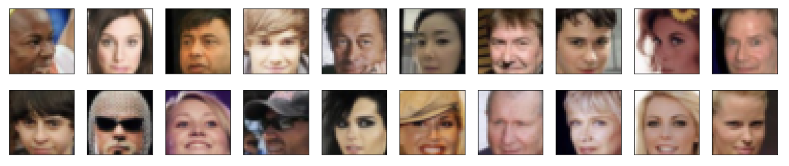
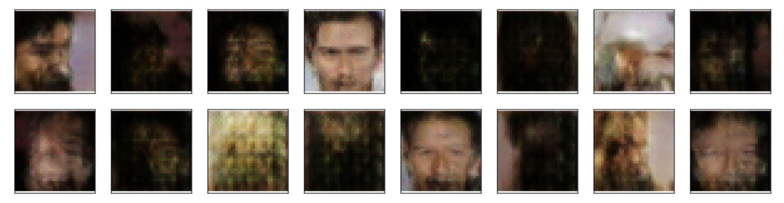

## Project Overview

This is the fourth project of the Udacity Deep Learning Nanodegree. In this project, I built a face generator that tries to generate new, realistic face images after being trained on a database of celebrity faces. The model uses deep convolutional generative adversarial networks (DCGANs).

## Training Dataset

The face generator is trained on the [Large-scale CelebFaces Attributes (CelebA) Dataset](http://mmlab.ie.cuhk.edu.hk/projects/CelebA.html), made available by the Chinese University of Hong Kong.

A sample of the preprocessed images are shown here:



## Model Structure

The model are built on DCGANs. Both the generator and the discriminator are composed of four convolutional/deconvolutional layers and one fully connected layer. The discriminator class uses Leaky ReLU activation function with alpha=0.2, which helps with the gradient flow and attemps to alleviate the problem of sparse gradients. I also added batch normalization after each layer in order to minimize internal covariate shift and stabilize model training as well as [one-sided label smoothing](https://arxiv.org/abs/1606.03498).

The model trained for 25 epochs, which took well over 2 hours to complete on a GPU. A sample of the generated faces are shown here:



## Python Package Dependencies

* [PyTorch](https://pytorch.org/)
* [NumPy](https://numpy.org/install/)
* [matplotlib](https://matplotlib.org/3.3.0/users/installing.html)

## Run Instructions

1. Clone the repository and navigate to the downloaded folder.
	
	```	
		git clone https://github.com/chloeh13q/DLND-Face-Generation
		cd DLND-Face-Generation
	```
2. Make sure you have already installed the necessary Python packages.
3. Open a terminal window and navigate to the project folder. Open the notebook and follow the instructions.
	
	```
		jupyter notebook dlnd_face_generation.ipynb
	```
